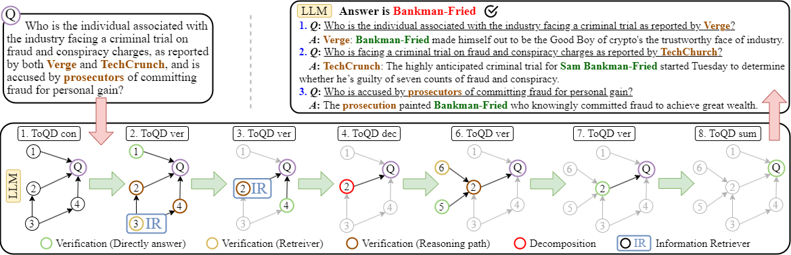
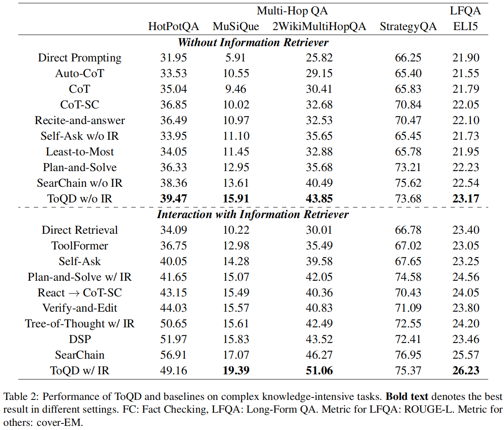
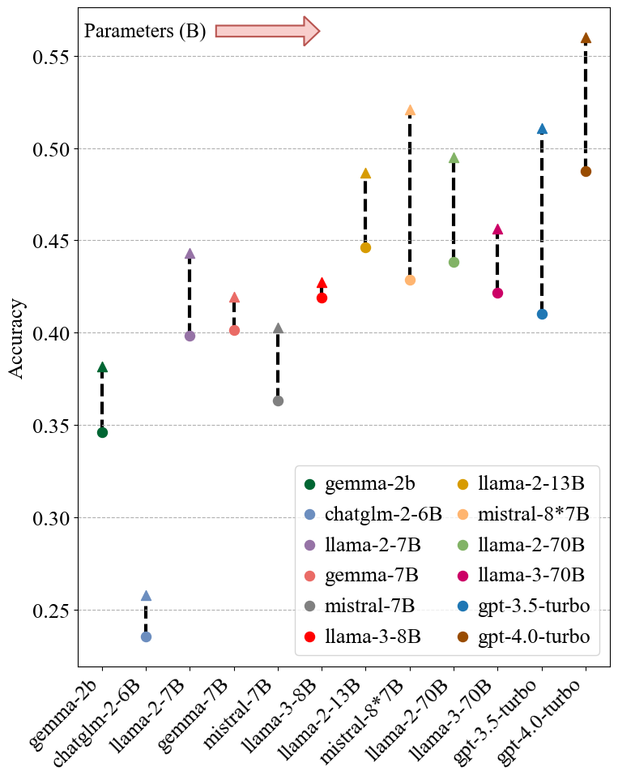

# Topology-of-Question-Decomposition: Enhancing Large Language Models with Information Retrieval for Knowledge-Intensive Tasks

This is the project of **Topology-of-Question-Decomposition: Enhancing Large Language Models with Information Retrieval for Knowledge-Intensive Tasks** (ToQD)

----------------------------------------------------------------

## Overview

**Abstract**

Multi-hop question answering, a complex and knowledge-intensive task, increasingly employs retrieval-augmented generation (RAG) methods supported by large language models (LLMs) to facilitate the generation of a traceable reasoning process. While RAG significantly bolsters the credibility and factuality of LLMs' responses, their abilities for reasoning (e.g., chain-of-thought) and retrieving relevant documents have primarily been studied as separate topics. Furthermore, non-discriminatory retrieval practices, rather than those tailored to specific LLM requirements, markedly impede reasoning processes and risk-inducing response hallucinations. In this paper, we introduce a novel framework named **T**opology-**o**f-**Q**uestion-**D**ecomposition (**ToQD**), which enables retrieval only when necessary. Globally, ToQD instructs LLMs to construct a topology graph from the input question, wherein each node encapsulates a sub-question. Locally, ToQD employs **_self-verify_** inference to determine whether a sub-question should retrieve relevant documents, necessitate further decomposition, or directly provide an answer. Experiments indicate that ToQD exhibits superior performance and robustness in complex knowledge-intensive tasks, effectively diminishing reliance on IR interactions and broadening adaptability across models ranging from 2B to over 100B parameters.

The framework of ToQD:



The overall results of ToQD:



The robustness test results of ToQD:




## Requirements

**Note**: We use Python 3.11 for ToQD to get started, install conda and run:

```shell
git clone https://github.com/DCVDB/ToQD.git
conda create -n ToQD python=3.11
...
pip install -r requirements.txt
```


## Retriever Setup

The retriever setup is the same as the [Self-RAG](https://github.com/AkariAsai/self-rag/tree/main?tab=readme-ov-file)

By default, we use [Contriever](https://github.com/facebookresearch/contriever) as our retrieval component.

Download preprocessed passage data used in DPR.
```shell
cd retrieval_lm
wget https://dl.fbaipublicfiles.com/dpr/wikipedia_split/psgs_w100.tsv.gz
```

Then, download the generated passages. We use [facebook/contriever-msmarco](https://huggingface.co/facebook/contriever-msmarco)

```
wget https://dl.fbaipublicfiles.com/contriever/embeddings/contriever-msmarco/wikipedia_embeddings.tar
```

**Warning**: We tested the evaluation script using on 1 RTX 4090 with 24GB and 128GB RAM (but should be runnable with much smaller RAM). 


## OpenAI Setup

Considering, our overall experiment is based on the **_gpt-3.5-turbo_** sourced API from [https://openai.com/index/openai-api/](https://openai.com/index/openai-api/)

Therefore, you need to enter the open-ai-apikey in the .env file.

```
OPENAI_API_KEY="YOUR_OPENAI_API_KEY"
```

## Run ToQD

1. ToQD without IR

```shell
python ToQD_without_IR.py \
    --llm_name gpt-3.5-turbo \
    --platform openai \
    --temperature 0 \
    --top_p 0.10 \
    --dataset_path ./data/wiki_multi_hop_qa/dev.json \
    --results_dir ./results/withoutIR/ \
    --verbose False

```

2. ToQD with IR

```shell
python ToQD_with_IR.py \
    --llm_name gpt-3.5-turbo \
    --platform openai \
    --temperature 0 \
    --top_p 0.10 \
    --dataset_path ./data/wiki_multi_hop_qa/dev.json \
    --results_dir ./results/withIR/ \
    --verbose False \
    --passages ./db/wikipedia/psgs_w100.tsv \
    --passages_embeddings "./db/wikipedia/wikipedia_embeddings/*" \
    --n_docs 100 \
    --top_n 1 \
    --validation_workers 32 \
    --per_gpu_batch_size 64 \
    --save_or_load_index \
    --model_name_or_path facebook/contriever-msmarco \
    --cache_dir ./repo \
    --no_fp16 \
    --question_maxlength 512 \
    --indexing_batch_size 1000000 \
    --projection_size 768 \
    --n_subquantizers 0 \
    --n_bits 8 \
    --lang <languages> \
    --dataset none \
    --lowercase \
    --normalize_text
```